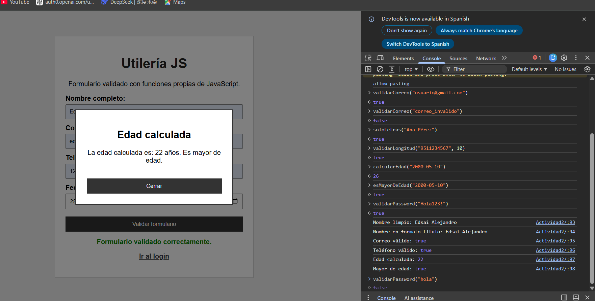
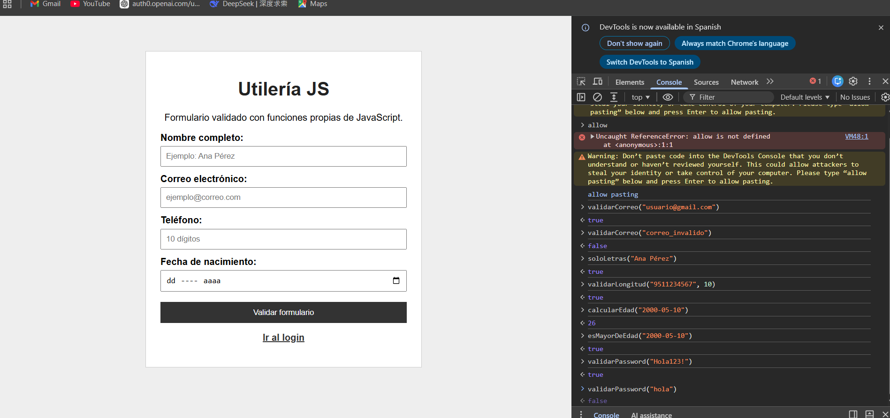

# Actividad 2 - Utilería JS

## Portada

Nombre: Edsai Alejandro García Reyes  
Proyecto: Utilería JS  
Materia: Programación Web  
Docente: Adelina Martinez Nieto

## ¿Qué problema resuelve?

Esta librería JavaScript permite validar datos comunes dentro de formularios web. Su objetivo es reutilizar funciones para validar correos electrónicos, nombres, números, fechas de nacimiento y contraseñas seguras.

El proyecto incluye una página con formulario, una ventana modal que muestra la edad calculada y una página de login que valida correo y contraseña.

## Instalación

Para usar la librería se debe enlazar el archivo `utileria.js` dentro del HTML:
```html
<script src="js/utileria.js"></script>
```
## Capturas de pantalla

### Formulario, modal y consola funcionando



### Consola mostrando resultados



## Uso con ejemplos de código

### Validar correo electrónico

```javascript
console.log(validarCorreo("usuario@gmail.com"));
console.log(validarCorreo("correo_invalido"));
```

### Validar solo letras

```javascript
console.log(soloLetras("Ana Pérez"));
console.log(soloLetras("Ana123"));
```

### Validar longitud de un número

```javascript
console.log(validarLongitud("9511234567", 10));
console.log(validarLongitud("123456789012", 10));
```

### Calcular edad

```javascript
console.log(calcularEdad("2000-05-10"));
```

### Validar mayoría de edad

```javascript
console.log(esMayorDeEdad("2000-05-10"));
console.log(esMayorDeEdad("2010-05-10"));
```

### Validar contraseña segura

```javascript
console.log(validarPassword("Hola123!"));
console.log(validarPassword("hola"));
```

### Función adicional: convertir texto a título

```javascript
console.log(convertirTitulo("juan perez"));
```

### Función adicional: limpiar espacios

```javascript
console.log(limpiarEspacios("   Hola     mundo   "));
```

## Video demostrativo

El video demostrativo tiene una duración máxima de 1 minuto. En él la librería, cómo se pone en acción dentro del formulario, modal, login y consola.

Enlace del video:
https://drive.google.com/file/d/19k4wDX7IndqxQkfU-74AcbE8sJ1YyZUm/view?usp=drive_link
